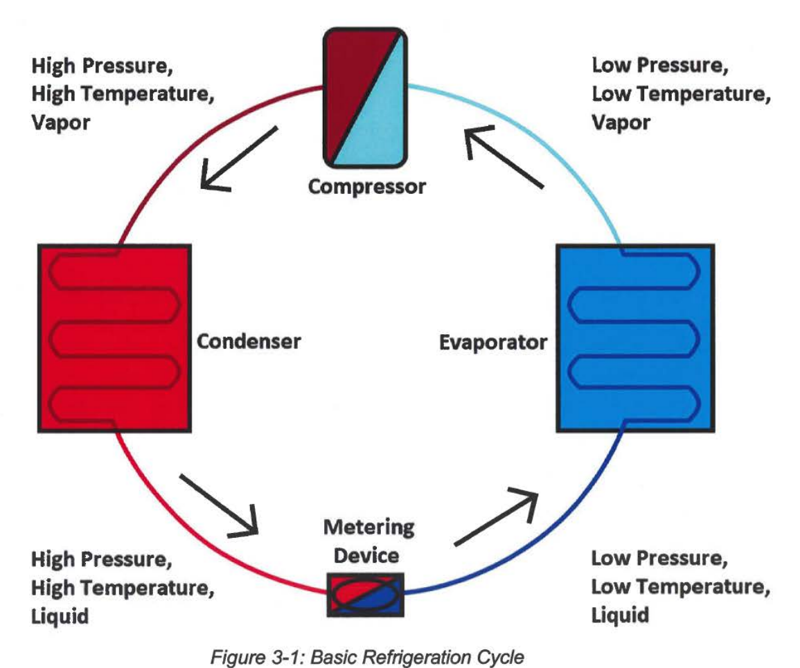
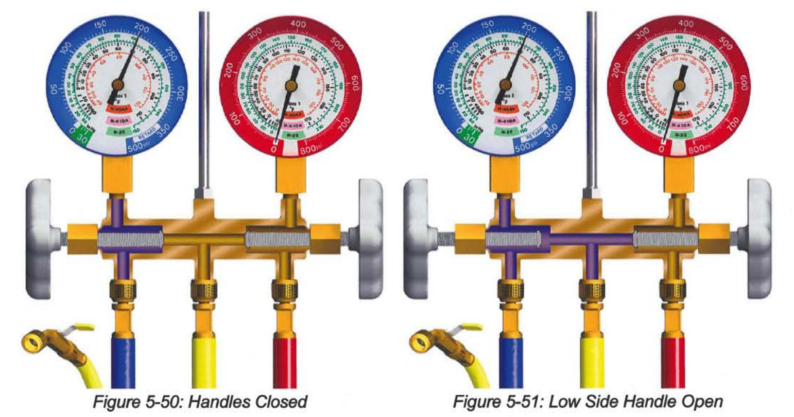
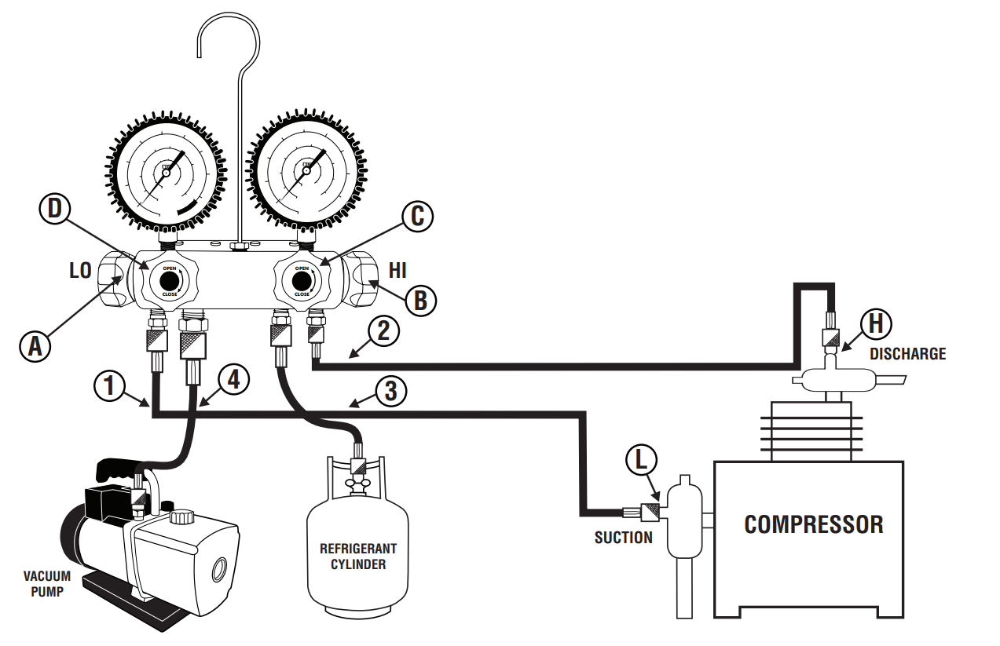

+++
date = '2025-03-06T08:32:55-05:00'
draft = false
title = 'HVAC'
+++

## Saturated Refrigerant Temperature Basics

- The saturated state of a refrigerant refers to the condition where the refrigerant exists in both its liquid and vapor states simultaneously, at a specific temperature and pressure. This occurs during key phases of the refrigeration cycle—boiling in the evaporator and condensing in the condenser.
- Key Points:
  - Saturation Temperature: The temperature at which the refrigerant changes phase from liquid to vapor at a given pressure.
  - Saturation Pressure: The pressure at which the refrigerant changes phase from vapor to liquid at a specific temperature.
  - Practical Applications: Technicians use pressure-temperature charts to determine the saturation temperature of a refrigerant in HVAC systems

### Thermal Expansion Valve

- it expands the refrigerant.
- it reduces the refrigerant pressure and the refrigerant temperature.
- it sends a required amount of refrigerant to evaporator.
- https://www.youtube.com/watch?v=nsp0bkaywyI.
- https://www.youtube.com/watch?v=DlJPCgnqfSY.

## Full Recovery Refrigerant

- https://www.youtube.com/watch?v=xEITCiUuaqo.

## Latent Heat vs Sensible Heat

- https://www.youtube.com/watch?v=ZYLPQJxNOhE.

## Refrigeration Cycle

- The four basic components of the Refrigeration Cycle are the Compressor, Condenser, 
Metering Device, and Evaporator

- Step 1 - At the compressor:
  - The refrigerant enters as 
    - a low pressure,
    - a low temperature,
    - superheated vapor. 
  - and exits as 
    - a high pressure,
    - high temperature,
    - superheated vapor. 
- Step 2 - In the condenser:
  - The refrigerant rejects heat. The refrigerant enters as
    - a high pressure,
    - a high temperature,
    - superheated vapor 
  - and exits as 
    - a high pressure,
    - a high temperature,
    - subcooled liquid. 
- Step 3 - At the metering device:
  - The refrigerant enters as
    - a high pressure,
    - a high temperature liquid 
  - and exits as 
    - a low pressure,
    - a low temperature liquid. 
- Step 4 - In the evaporator:
  - The refrigerant absorbs heat. The refrigerant enters as
    - a low pressure,
    - a low temperature liquid.
  - and exits as
    - a low pressure, 
    - a low temperature, 
    - superheated vapor. 
  - After this, the refrigerant re-enters the compressor
- ***Superheating refers to when the refrigerant gains heat after it has changed completely into a vapor.***
- ***Subcooling refers to when the refrigerant loses heat after it has changed completely into a liquid.***
- Brief definitions for basic terms used:
  - ***Saturated: Liquid and vapor refrigerant exist together in the same location, at the same time.***
  - **Vapor:** The refrigerant is in the boiled state as a gas.
  - **Liquid:** The refrigerant is in the liquid state.
  - **Subcooling:** This is the temperature decrease of liquid refrigerant below the saturated temperature.
  - **Superheat:** This is the temperature increase of vapor refrigerant above the saturated temperature.
  - **Service Valve:** The valve allows the flow of refrigerant to be closed off for servicing.
  - **Compressor:** The rotary compressor pressurizes vapor refrigerant. Oil circulates through the system with the refrigerant and lubricates the compressor. Refrigerant traveling through the compressor removes heat from the electrical windings.
  - **Evaporator Coil:** In the evaporator coil the refrigerant absorbs heat and changes (evaporates) into a vapor.
  - **Condenser Coil:** In the condenser coil the refrigerant rejects heat and changes (condenses) into a liquid.
  - **Metering Device:** The metering device is a restriction that causes the refrigerant to reduce in pressure in order to expand.
  - **Line Set:** The line set is comprised of a large vapor tube and a small liquid tube. These tubes connect from the indoor unit to the outdoor unit on a mini split system The line set is connected by the technician in the field. 
  - **Accumulator:** The accumulator is a tank that protects the compressor by only allowing vapor refrigerant to enter the inlet of the vapor compressor. A version of this component is always found mounted to the inlet side of any rotary compressor. There may be an additional accumulator installed on a large capacity or multi-zone unit. The accumulator may also accumulate oil in the bottom of the tank which it meters back into the compressor.
  - ***Reversing Valve***: The reversing valve changes the direction of the refrigerant flow in a system. This component is only used in ***a Heat Pump***.

## Brazing Line Set Connections

- If oxygen is not removed when heating the copper tubing at high temperatures, oxidation will occur. If the residue mixes with the refrigerant oil within the system, it can reduce lubrication at the compressor. It can also cause gumming or clogging within system components. 
- To avoid this, only flow 3-5 CFH (cubic feet per hour) of nitrogen through the empty system's tubing while brazing. ***This can be done with the help of a flow meter attached to the nitrogen regulator.***

## Manifold Gauge Sets

- Three port Manifold Gauge Sets.

- Four port Manifold Gauge Sets.

