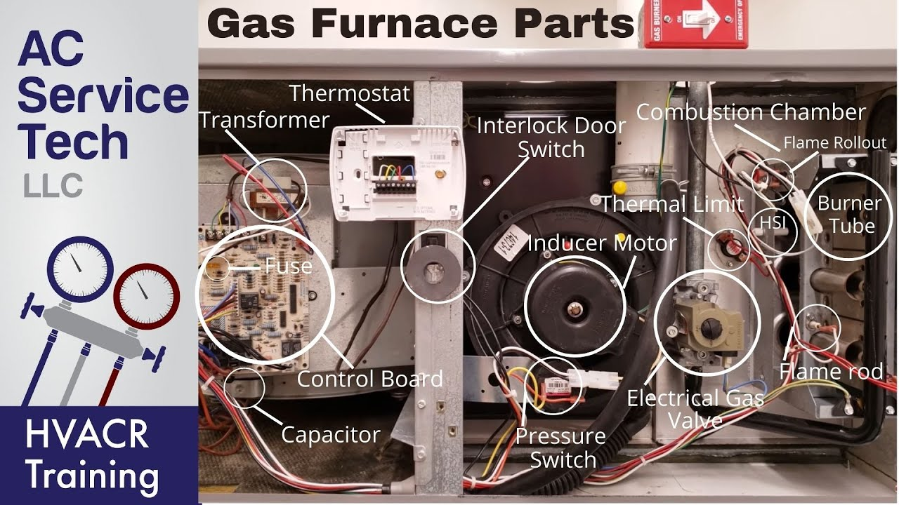
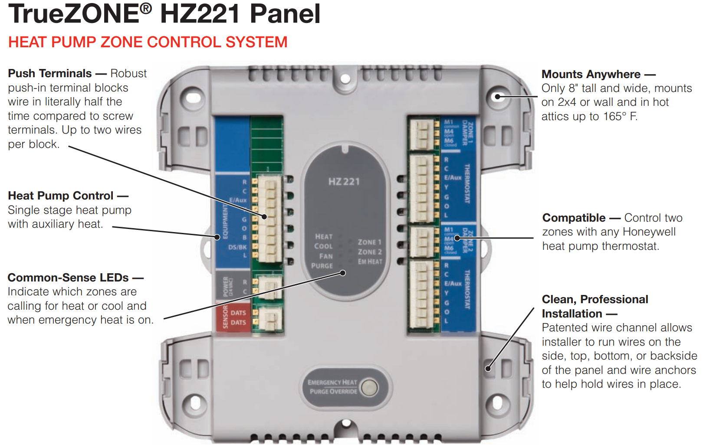
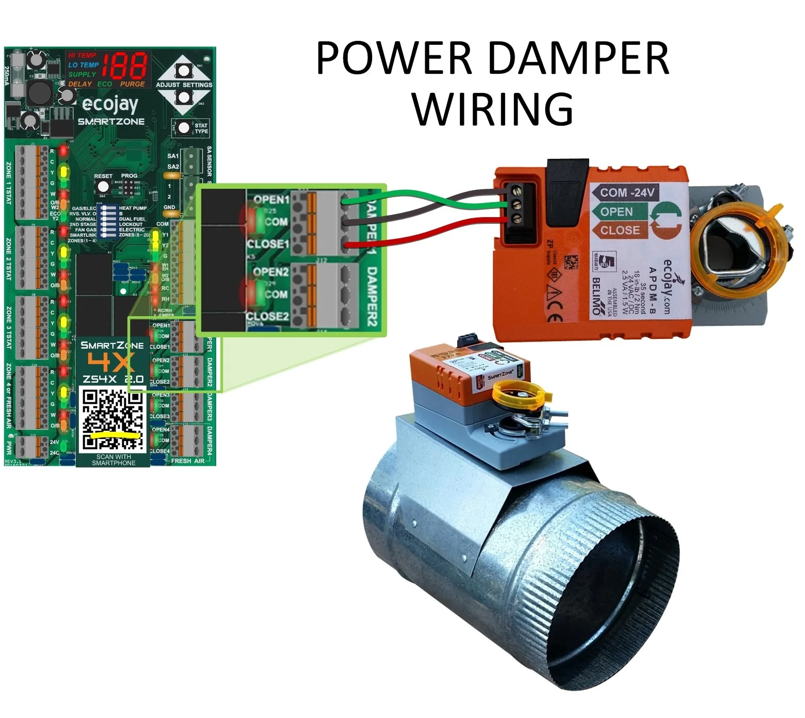
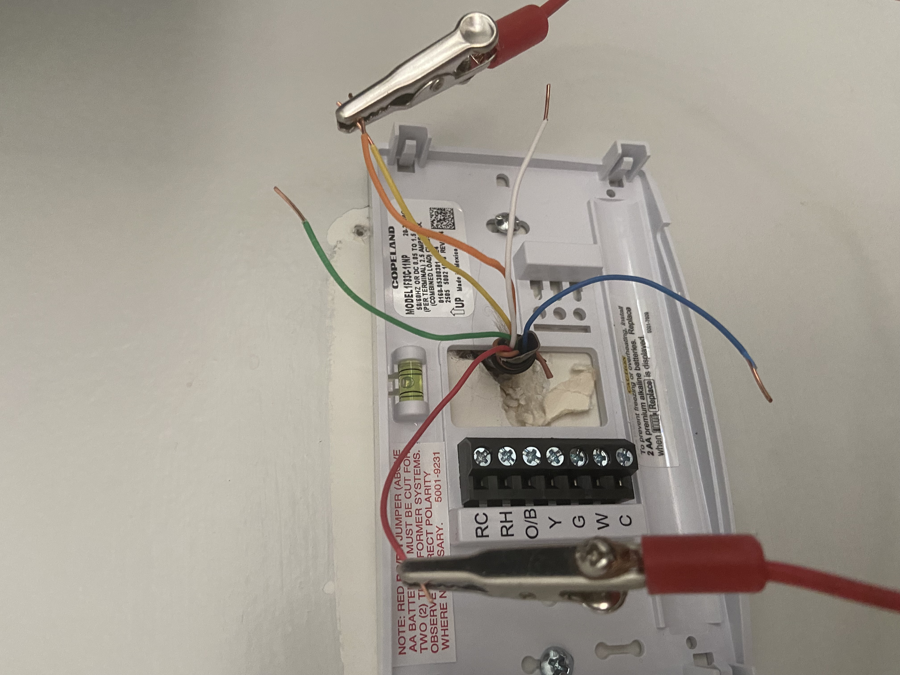

+++
date = '2025-03-06T08:32:43-05:00'
draft = false
title = 'Gas Furnace installation'
+++

## Gas Furnace Component

## Installation

1. Power switch
2. Gas pipe

3. Thermostat wire - https://www.digikey.com/en/articles/comprehensive-guide-to-thermostat-wire-types-applications-wiring-techniques?gclid=1c263537dcf919338a245c14d57e75dc&gclsrc=3p.ds&msclkid=1c263537dcf919338a245c14d57e75dc.
   1. Red - 24v wire.
   2. Yellow -  Cool wire.
   3. White - Heat wire.
   4. Green - Fan wire.
   5. Blue - Common wire.

4. Door switch
5. PVC drain pipe
6. Air filter
7. Float switch

8. Condensor Pump
9. Capacitor - https://www.youtube.com/watch?v=5_0nKm940nA.

## Zoning

1. Thermostat wire connected to Zoning Board

2. Zone board control wire connect to EWC Damper wire.

## Thermostat Calling Service

1. AC and Coil
   - Calling Service for Cooling
     - Connect Red wire to Yellow wire.
   - Calling Service for Heating
     - Connect Red wire to White wire
   - Calling Service for Fan Only
     - Connect Red wire to Green wire
2. Heat Pump
   - Calling Service for Cooling
     - Connect Red wire to Yellow wire and Orange wire(Heat Pump control wire).

   - Calling Service for Heating
     - Connect Red wire to White wire and Orange wire(Heat Pump control wire).
   - Calling Service for Fan Only
     - Connect Red wire to Green wire.
