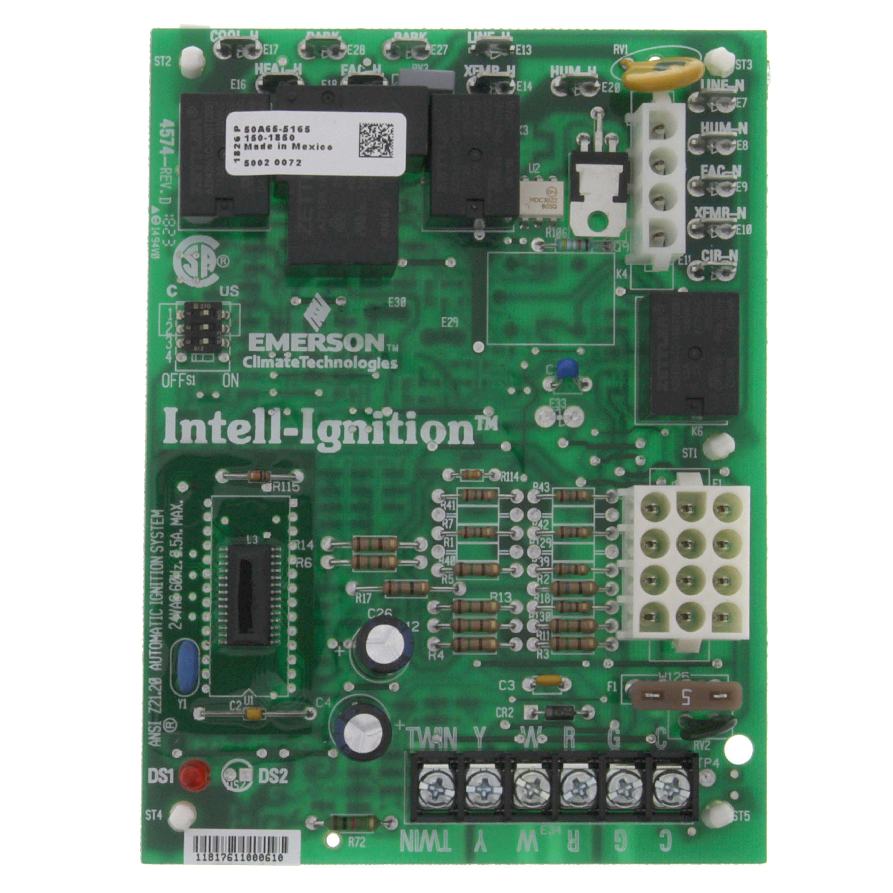
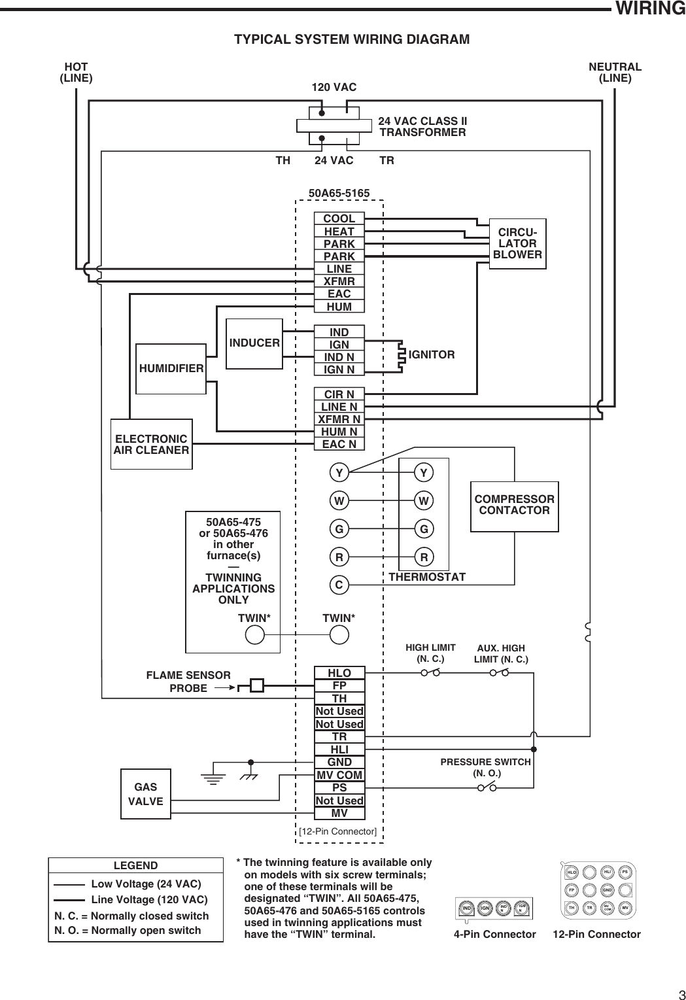
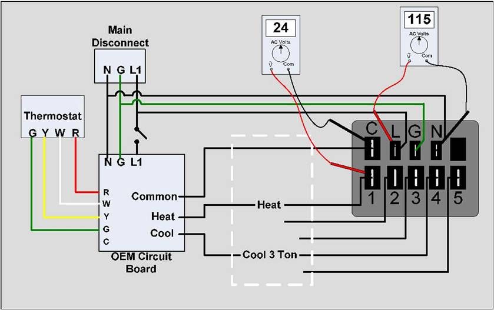

+++
date = '2025-03-06T08:32:43-05:00'
draft = false
title = 'Gas Furnace Wire Diagram'
+++

## How to connect wire for Gas Furnace TRANE Control Board 50A65-5165

### Control Board

 .

### Control Board WIRE DIAGRAM

 .

### Blower Motor

- [What is PSC Blower Motor](https://www.youtube.com/watch?v=Gb6uOGICsXg&t=80s) - 120v supply power.
  - PSC Blower Motor wire example

    |       | Black |   Yellow    |    Blue    |  Red  | White(Neutral/Common) |
    | :---- | :---: | :---------: | :--------: | :---: | :-------------------: |
    | Ohm   | 3.70  |    4.35     |    5.16    | 6.23  |           -           |
    | Amps  | 7.60  |    6.90     |    6.00    | 5.20  |           -           |
    | Speed | High  | Medium-high | Medium-low |  Low  |           -           |

- [What is ECM Blower Motor](https://www.youtube.com/watch?v=qpQnNeNKVbw&pp=0gcJCSIKAYcqIYzv) - 120v/240v supply power

    |       |   5   |      4      |     3      |   2   |   1    |
    | :---- | :---: | :---------: | :--------: | :---: | :----: |
    | Speed | High  | Medium-high | Medium-low |  Low  | Lowest |

  

### Condenser Fan Motor

- It is as same as [PSC Blower Motor](#blower-motor-wire).
- [How to](https://youtu.be/kDALMtL9MdU?si=81LA7vmpbUGHZzFV&t=355).

### Sequence of Operation 

.

- https://www.youtube.com/watch?v=gN-UIr6824w.
- https://www.youtube.com/watch?v=u3bxZRjXxRM.

1. **Thermostat Call for Heat**: 
   1. The sequence begins when the thermostat detects that the room temperature is below the set point. It sends a low-voltage signal to the furnace’s control board to initiate the heating cycle. 
2. **Inducer Motor Activation**: 
   1. The inducer motor starts, creating a draft that clears any residual combustion gases from the heat exchanger and establishes proper airflow. This step is crucial for preventing dangerous gas buildup. 
3. **Pressure Switch Check**: 
   1. A pressure switch verifies that the inducer motor has created sufficient draft pressure.
   2. If the required vacuum isn’t present, the ignition process is halted to ensure safety. 
4. **Ignition System Activation**:
   1. Once the pressure switch confirms safe airflow, the ignition system activates. This can involve a hot surface igniter glowing orange or a spark igniter creating a spark to ignite the gas. 
5. **Gas Valve Opening**:
   1. After the ignition system is ready, the control board energizes the gas valve, allowing gas to flow to the burners. 
6. **Flame Establishment**:
   1. The flame sensor detects the presence of a flame.
   2. If the flame is established, the system continues.
   3. If not, the gas flow is shut off to prevent unsafe conditions. 
7. **Blower Motor Activation**:
   1. After the flame is stable, the blower motor starts, drawing air from the return ducts and forcing it over the heat exchanger.
   2. This heated air is then circulated throughout the home. 
8. **Post-Purge**:
   1. After the heating cycle is complete, the furnace may enter a post-purge phase where the inducer motor continues to run for a short period to clear out any remaining gases before shutting down. 
